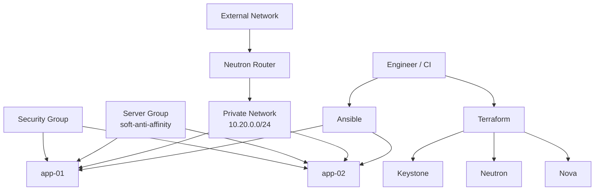

# OpenStack Platform Lab

> **Portfolio / demonstration project.** This repository contains no code, credentials, configuration, or proprietary information from any current or previous employer.

A production-inspired infrastructure lab that demonstrates how I approach **OpenStack provisioning, Linux bootstrap, configuration management, reliability, and operational documentation**.

## What this project demonstrates

- OpenStack infrastructure provisioning with Terraform
- Neutron networking: private network, subnet, router, external gateway
- Security-group design with restricted administrative access
- Nova server anti-affinity for basic workload resilience
- cloud-init bootstrap for first-boot configuration
- Ansible post-provision configuration
- CI validation for Terraform and Ansible
- Operational runbook and security notes
- Clear separation between provisioning, configuration, and operations

## Architecture



## Repository structure

```text
.
├── .github/workflows/validate.yml
├── ansible/
├── cloud-init/
├── docs/
├── scripts/
├── terraform/
├── .gitignore
└── Makefile
```

## Design principles

### 1. Keep credentials out of Terraform code
Use an OpenStack `clouds.yaml`, application credentials, or standard `OS_*` environment variables. Never commit credentials to this repository.

### 2. Separate infrastructure from configuration
Terraform creates cloud resources. cloud-init provides the minimum bootstrap needed at first boot. Ansible handles repeatable operating-system configuration after the instances are reachable.

### 3. Prefer restricted access
SSH ingress is limited to `admin_cidr`. The example value is deliberately non-routable and must be replaced before deployment.

### 4. Treat resilience as a platform concern
The demo instances are placed into a `soft-anti-affinity` Nova server group so the scheduler will try to place them on different compute hosts where possible.

## Prerequisites

- Terraform 1.x
- OpenStack credentials with permissions to create Nova and Neutron resources
- Existing OpenStack image, Nova flavor, SSH key pair and external network
- Ansible
- `jq` for automatic inventory generation

## Quick start

```bash
source openrc.sh
openstack token issue
cp terraform/terraform.tfvars.example terraform/terraform.tfvars
make fmt
make validate
make plan
make apply
make inventory
make ansible
```

Destroy the lab when finished:

```bash
make destroy
```

## Security notes

This is a demonstration project, not a full production landing zone. A production implementation should additionally consider least-privilege application credentials, encrypted remote state, CI secret management, bastion/VPN access, centralized logging, image hardening, backups, failure-domain design, quotas, policy-as-code and drift detection.

See [`docs/security.md`](docs/security.md).

## Operational thinking

The goal is not just to prove that Terraform can create a VM. The project also demonstrates access control, failure-domain awareness, repeatable bootstrap, configuration ownership, drift reduction and operational documentation.

See [`docs/runbook.md`](docs/runbook.md).

## Tech stack

`OpenStack` · `Nova` · `Neutron` · `Keystone` · `Terraform` · `cloud-init` · `Ansible` · `Linux` · `GitHub Actions`

## Author

**Vladislav Zakharov**  
Senior DevOps / Platform Engineer
